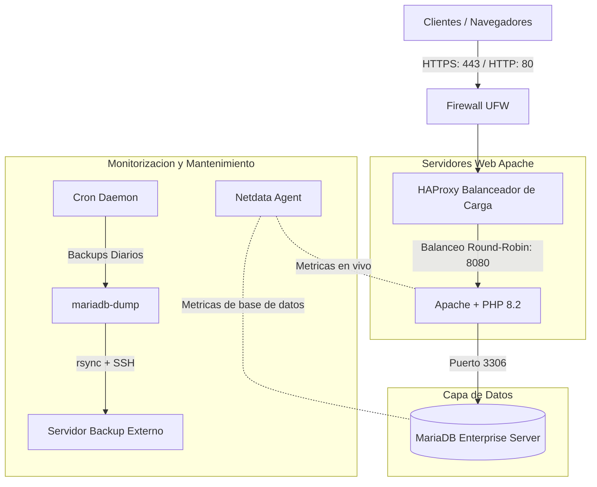

# Proyecto de Documentacion: Despliegue de Infraestructura LAMP con HAProxy y Monitorizacion

Este repositorio contiene la documentacion tecnica profesional de nivel consultoria para el despliegue, securizacion, monitorizacion y recuperacion ante desastres de la infraestructura web y de base de datos para la PYME **GastroTech S.L.** (Portal de reservas y sistema de facturacion interna).

- Disenado y documentado colaborativamente por:

## 📊 Arquitectura de la Infraestructura

## 📁 Estructura del Repositorio

- 📋 **[tareas.md](tareas.md)**: Tablero de tareas del equipo (Kanban).
- 📜 **[CHANGELOG.md](CHANGELOG.md)**: Registro historico de versiones y modificaciones.
- 🔎 **[REVISION.md](REVISION.md)**: Reflexion sobre el trabajo en equipo, resolucion de conflictos Git y rotacion de roles.
- 📚 **Documentacion Tecnica (`/docs`):**
  1. 📄 **[01-Analisis de Requisitos](docs/01-analisis.md)**: Justificacion tecnologica y dimensionamiento.
  2. 🖥️ **[02-Diseno de Arquitectura](docs/02-diseno.md)**: Esquemas de red y especificacion de versiones de software.
  3. 📅 **[03-Planificacion Temporal](docs/03-planificacion.md)**: Hitos del proyecto (Gantt) y roles.
  4. ⚙️ **[04-Instalacion y Configuracion](docs/04-instalacion/):**
     - 🖧 **[Servidor Web & HAProxy](docs/04-instalacion/servidor-web.md)**: Despliegue de Apache, PHP 8.2 y balanceador HAProxy.
     - 🗄️ **[Base de Datos](docs/04-instalacion/base-de-datos.md)**: Estructuracion y securizacion de MariaDB.
     - 🔐 **[SSH & UFW Firewall](docs/04-instalacion/ssh-firewall.md)**: Bastionado del acceso SSH y reglas del cortafuegos.
     - 📈 **[Monitorizacion con Netdata](docs/04-instalacion/monitorizacion.md)**: Dashboards de rendimiento y alertas proactivas.
     - 💾 **[Copias de Seguridad (Backups)](docs/04-instalacion/backups.md)**: Scripts automatizados y politicas de rotacion de copias.
  5. 🛠️ **[05-Guia de Operacion Diaria](docs/05-operacion.md)**: Tareas de mantenimiento preventivo, auditorias de logs y solucion de problemas.
  6. ☁️ **[06-Plan de Recuperacion ante Desastres](docs/06-recuperacion.md)**: Guia paso a paso ante perdida de servicios o corrupcion de datos.