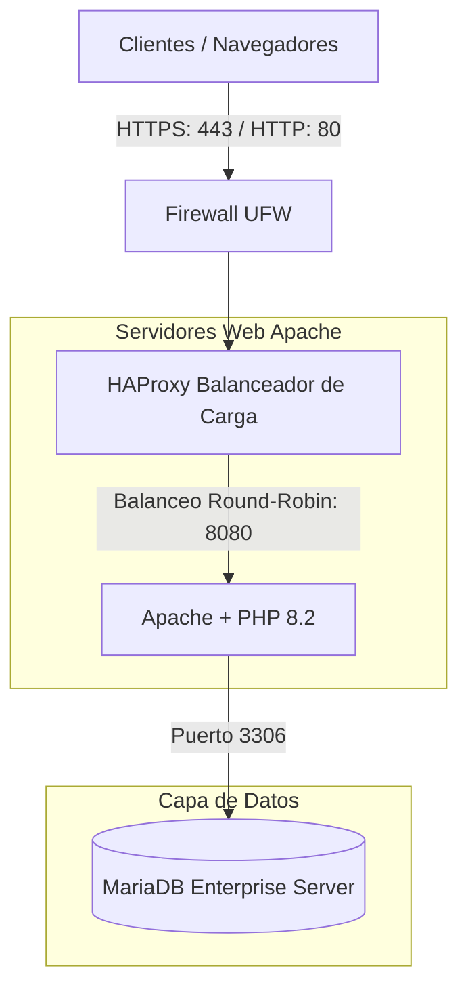

# 02. Diseno de Arquitectura

El diseno fisico y logico de la red y servicios necesarios para satisfacer los requisitos del cliente.

## Esquema Logico de Red (Diagrama Mermaid)

## Tabla de Componentes de Software (Final Integrada)

| Componente | Version | Descripcion / Funcion |
| :--- | :--- | :--- |
| **Sistema Operativo** | Ubuntu Server 22.04 LTS | Sistema operativo base corporativo |
| **Balanceador de Carga** | HAProxy 2.6 | Proxy inverso y terminacion SSL |
| **Servidor Web** | Apache 2.4.60 | Servidor web (corriendo en puerto interno 8080) |
| **Base de Datos** | MariaDB 10.11 | Servidor de base de datos relacional |
| **Certbot** | 2.9 | SSL/TLS automatico (anadido) |
| **Entorno Ejecucion** | PHP 8.2 | Lenguaje de scripts del portal y facturacion |