# 03. Planificación Temporal del Proyecto

La planificación del despliegue se ha diseñado para cubrir un ciclo completo de 4 semanas (sesiones), organizando las responsabilidades de forma equitativa.

## Hitos del Proyecto (Diagrama de Gantt)

```mermaid
gantt
    title Despliegue de Infraestructura LAMP y Monitorización
    dateFormat  YYYY-MM-DD
    section Fase 1: Análisis y Bases
    Estructura Inicial & README    :done, s1, 2026-05-25, 1d
    Análisis de Requisitos (Sofía) :done, s2, 2026-05-25, 2d
    Estrategias Backups (Mateo)    :done, s3, 2026-05-25, 2d
    section Fase 2: Configuración
    Instalación Web y BD (Mateo)  :active, s4, 2026-05-26, 3d
    Fortalecimiento SSH/UFW (Ambos):active, s5, 2026-05-26, 2d
    section Fase 3: Operación & DRP
    Guía de Mantenimiento (Sofía) :s6, 2026-05-28, 3d
    Plan de Recuperación (Sofía)  :s7, 2026-05-28, 2d
```

## Roles e Intercambio de Responsabilidades

- **Sesión 1 y 2**:
  - *Documentalista de Plataforma*: **Sofía** (Análisis, Diseño, Servidor Web).
  - *Documentalista de Operaciones*: **Mateo** (Backups, Monitorización, CHANGELOG).
- **Sesión 3 y 4 (Intercambio Rotativo)**:
  - *Documentalista de Plataforma*: **Mateo** (Instalación de servicios y base de datos).
  - *Documentalista de Operaciones*: **Sofía** (Guías de mantenimiento, DRP y CHANGELOG).