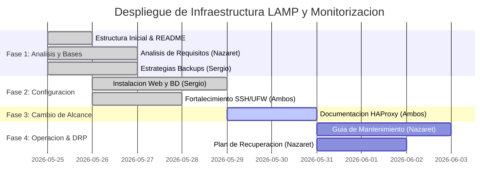

# 03. Planificacion Temporal del Proyecto

La planificacion del despliegue se ha disenado para cubrir un ciclo completo de 4 semanas (sesiones), organizando las responsabilidades de forma equitativa.

## Hitos del Proyecto (Diagrama de Gantt)

## Roles e Intercambio de Responsabilidades

- **Sesion 1 y 2**:
  - *Documentalista de Plataforma*: **Nazaret** (Analisis, Diseno, Servidor Web).
  - *Documentalista de Operaciones*: **Sergio** (Backups, Monitorizacion, CHANGELOG).
- **Sesion 3 y 4 (Intercambio Rotativo)**:
  - *Documentalista de Plataforma*: **Sergio** (Instalacion de servicios, balanceador HAProxy y base de datos).
  - *Documentalista de Operaciones*: **Nazaret** (Guias de mantenimiento, DRP y CHANGELOG).